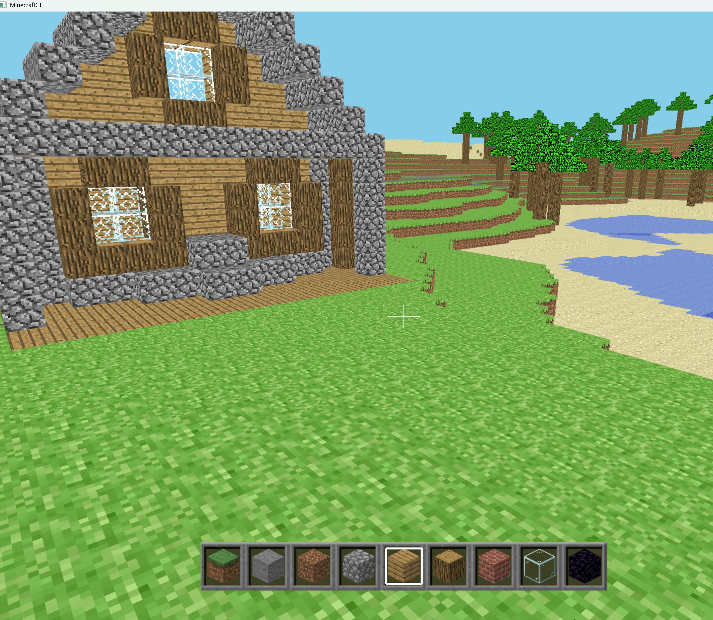

# Minecraft Game 

A Minecraft inspired game created using C++, OpenGL, and SDL

## Features
- Infinitely generated world using Perlin Noise
- Multiple biomes (plains, desert, mountains, forest)
- Saving your progress / builds (persistent worlds basically)
- World saves are compressed using custom made Huffman encoding to decrease world size on disk
- Thread pool used to efficiently compute terrain, create meshes and vertices for multiple chunks in the background

